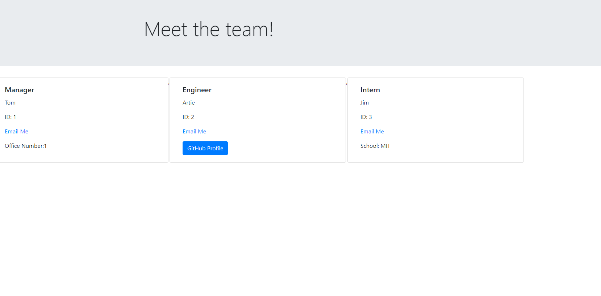

# Team Profile Generator
        
## Description
        
Providing a user friendly interface to create a Team HTML page based on what the User types in the terminal.
        
## Table of Contents
        
- [Installation](#installation)
- [Usage](#usage)
- [Credits](#credits)
- [License](#license)
- [Tests](#tests)
- [Questions](#questions)
- [Repository](#repository)
     
        
## Installation

Please use 'npm i', 'npm i inquirer', & 'npm i jest' in the terminal to download necessary packages for this application
        
        
## Usage
 
Video Link: https://drive.google.com/file/d/15VF_jXrcWc9OwHHkHPKtEFVxCBd77TgA/view
        

        
## Credits

Worked with my tutor, Andrew Tirpok
 
## License
        
MIT
        
## Tests

Tested to see if an object was created with each of the 4 classes.
        
## Questions?

GitHub profile for contact purposes

https://github.com/artiecannv

## Repository
        
https://github.com/artiecannv/team-profile-gen